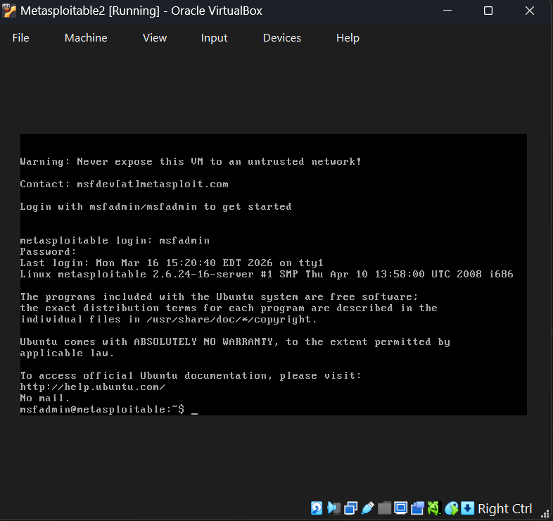
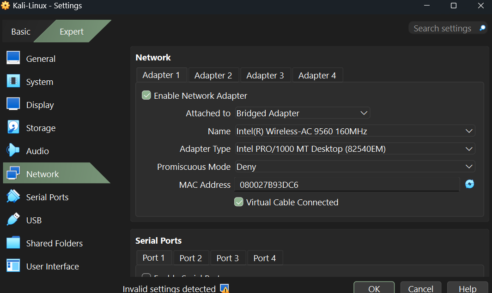
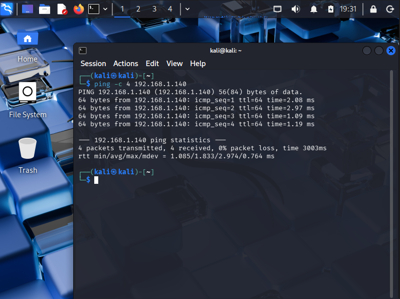
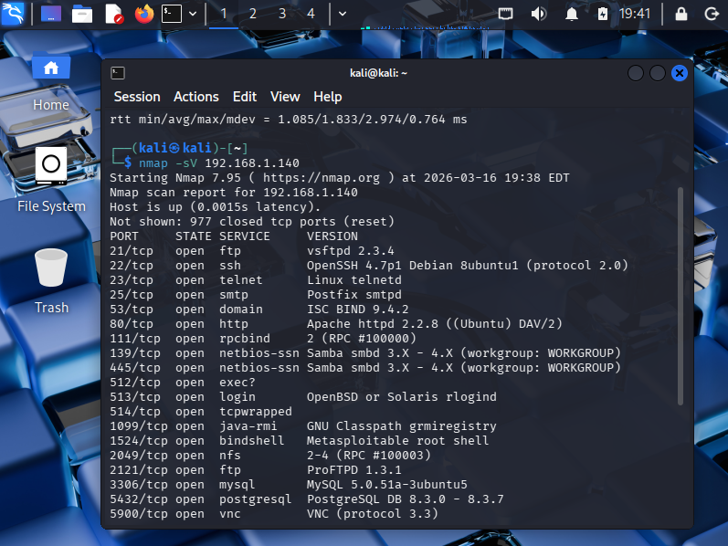

# Lab 01 — Home Lab Environment Setup

**Author:** Naheema Shafau
**Date:** November 2025
**Environment:** VirtualBox | Kali Linux | Metasploitable2 | Windows 11 Host

---

## Overview

This lab documents the design and configuration of a local virtualized 
lab environment used for hands-on IT and security skills development. 

Using VirtualBox as the hypervisor, I deployed two virtual machines — 
a Kali Linux system and a Metasploitable2 target — configured network 
connectivity between them, and validated the environment through 
scanning and discovery tools.

This environment serves as the foundation for all subsequent labs in 
this portfolio.

---

## Objectives

- Deploy and configure a Kali Linux virtual machine
- Deploy a Metasploitable2 vulnerable target VM
- Configure VirtualBox networking for inter-VM communication
- Validate connectivity using ping and Nmap
- Establish a stable, isolated lab environment for future exercises

---

## Tools & Technologies

| Component | Purpose |
|-----------|---------|
| VirtualBox | Hypervisor — hosts all virtual machines |
| Kali Linux | Primary lab workstation / security toolkit |
| Metasploitable2 | Intentionally vulnerable target for testing |
| Bridged Adapter | Network mode enabling inter-VM communication |
| Nmap | Network scanning and service discovery |
| Ping / ICMP | Basic connectivity validation |

---

## Lab Topology
```
[ Windows 11 Host ]
         |
    VirtualBox
         |
   ──────────────────────
   |                    |
Kali Linux  ←——→  Metasploitable2
(Attacker)         (Target)
   ──────────────────────
   Both VMs on Bridged Adapter — same LAN
```

---

## Step 1 — Kali Linux Installation

**Actions performed:**
- Imported Kali Linux ISO into VirtualBox
- Allocated 4GB RAM, 2 CPU cores, 30GB virtual disk
- Completed full graphical installation
- Installed GRUB bootloader
- Verified successful login to Xfce desktop environment

📸 

---

## Step 2 — Metasploitable2 Installation

**Actions performed:**
- Extracted `.vmdk` disk image
- Attached disk image to new VirtualBox VM
- Allocated 512MB RAM
- Disabled EFI boot
- Verified Metasploitable2 login screen with default credentials

📸 

---

## Step 3 — Network Configuration

### Initial Problems Encountered

| Attempt | Mode Used | Result |
|---------|-----------|--------|
| 1st | NAT | Loopback IP only (127.0.0.1) — no inter-VM communication |
| 2nd | Hyper-V | No DHCP assignment — VMs couldn't see each other |
| 3rd | Bridged Adapter | ✅ Both VMs received valid LAN IPs |

> **Note:** Documenting failed attempts is intentional — 
> troubleshooting and resolving configuration issues is a 
> core IT support skill.

### Working Configuration

- **Adapter Mode:** Bridged Adapter
- **Kali IP:** 192.168.1.x
- **Metasploitable2 IP:** 192.168.1.141

📸 
## Step 4 — Connectivity Validation

### Ping Test
```bash
ping -c 4 192.168.1.141
```
📸 

### Nmap Service Scan
```bash
nmap -sV 192.168.1.141
```
📸 

---

## Issues & Troubleshooting Log

| Issue | Cause | Resolution |
|-------|-------|------------|
| VMs couldn't communicate | NAT mode isolates VMs | Switched to Bridged Adapter |
| No IP assigned via Hyper-V | Hyper-V conflict with VirtualBox | Disabled Hyper-V in Windows features |
| Metasploitable2 wouldn't boot | EFI enabled | Disabled EFI in VM settings |

---

## Results

✅ Kali Linux VM deployed and operational
✅ Metasploitable2 VM deployed and accessible
✅ Inter-VM communication confirmed via ping
✅ Network services confirmed via Nmap scan
✅ Lab environment ready for subsequent exercises

---

## Key Takeaways

- Hypervisor networking modes behave differently — 
  understanding NAT vs Bridged vs Host-Only is essential 
  for lab and enterprise environments
- Troubleshooting network configuration requires systematic 
  testing and documentation of each attempt
- Virtual lab environments mirror real-world IT infrastructure 
  challenges at smaller scale

---

## Screenshots

| # | Description |
|---|-------------|
| 1 | VirtualBox VM list showing both machines |
| 2 | Kali Linux desktop after install |
| 3 | Metasploitable2 login screen |
| 4 | Bridged Adapter network settings |
| 5 | Successful ping to Metasploitable2 |
| 6 | Nmap scan results |
