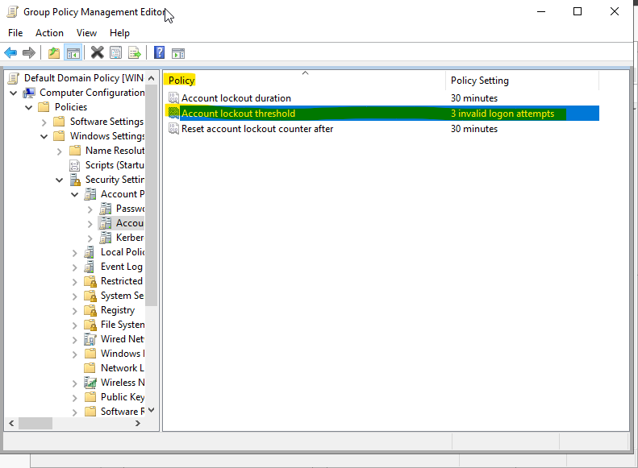
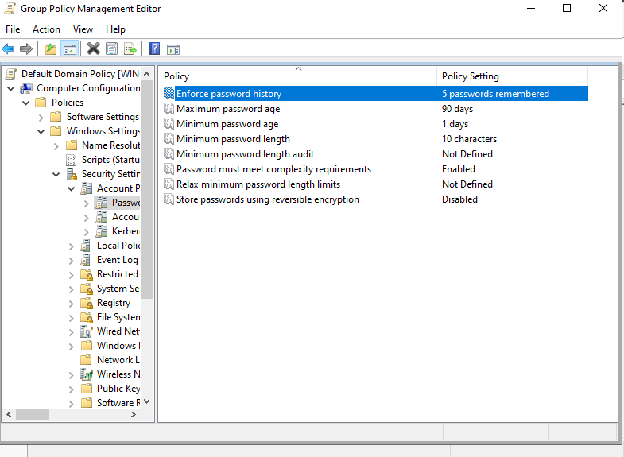
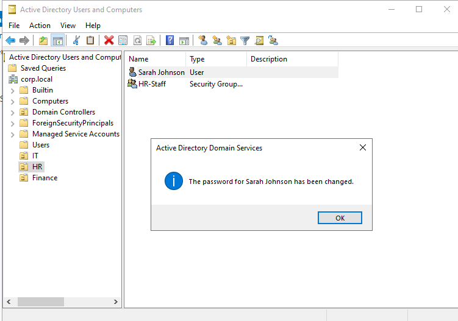
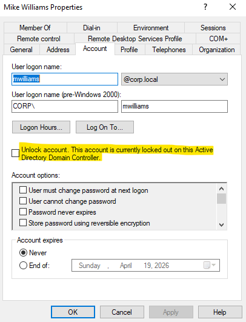
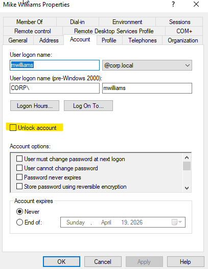
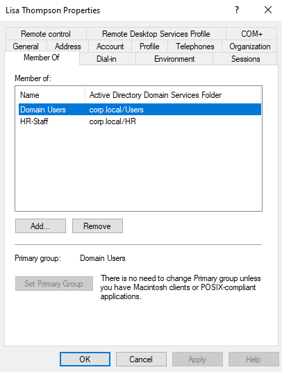

Amazing! Now let's write the full Lab 02 README. This will replace the placeholder we put in earlier.


Go to github.com/nshafau/it-portfolio
Click into 02-active-directory-lab
Click on README.md
Click the pencil icon to edit
Select all and delete everything
Paste this in:


markdown# Lab 02 — Active Directory Home Lab

**Author:** Naheema Shafau
**Date:** March 2026
**Environment:** Windows Server 2022 | VirtualBox | Windows 11 Host

---

## Overview

This lab documents the installation and configuration of a Windows 
Server 2022 Domain Controller with Active Directory Domain Services.

Acting as IT Administrator I built a fully functional AD environment 
including organizational units, user accounts, security groups, and 
group policies — mirroring the day to day tasks performed in a real 
enterprise Help Desk or SysAdmin role.

---

## Objectives

- Install and configure Windows Server 2022 in VirtualBox
- Promote server to a Domain Controller
- Install and configure Active Directory Domain Services
- Create Organizational Units (OUs)
- Create and manage user accounts
- Create and manage security groups
- Configure Group Policy Objects (GPOs)
- Perform common Help Desk tasks within AD

---

## Tools & Technologies

| Component | Purpose |
|-----------|---------|
| VirtualBox | Hypervisor hosting the virtual machines |
| Windows Server 2022 | Domain Controller and AD host |
| Active Directory Domain Services | Directory service for user and resource management |
| Group Policy Management | Policy configuration and enforcement |

---

## Lab Topology
```
[ Windows 11 Host ]
        |
   VirtualBox
        |
Windows Server 2022
(Domain Controller)
        |
   DOMAIN: corp.local
```

---

## Phase 1 — Windows Server Installation

Installed Windows Server 2022 Standard Evaluation (Desktop Experience) 
in VirtualBox as a clean fresh installation.

| Setting | Value |
|---------|-------|
| RAM | 4096 MB |
| CPU | 2 cores |
| Storage | 50 GB |
| Network | Bridged Adapter |
| Edition | Windows Server 2022 Standard (Desktop Experience) |


---

## Phase 2 — Active Directory Installation

Installed Active Directory Domain Services role through Server Manager 
and promoted the server to a Domain Controller for the corp.local domain.

### Components Installed
- Active Directory Domain Services
- Group Policy Management
- Remote Server Administration Tools
- Active Directory module for Windows PowerShell
- Active Directory Administrative Center


---

## Phase 3 — Active Directory Structure

### Organizational Units
Created three OUs representing company departments:

| OU | Purpose |
|----|---------|
| IT | Information Technology department |
| HR | Human Resources department |
| Finance | Finance department |


---

### User Accounts
Created user accounts for each department:

| Name | Username | Department |
|------|---------|-----------|
| John Smith | jsmith | IT |
| Sarah Johnson | sjohnson | HR |
| Mike Williams | mwilliams | Finance |
| Lisa Thompson | lthompson | HR |


---

### Security Groups
Created security groups for access control:

| Group | Scope | Department |
|-------|-------|-----------|
| IT-Admins | Global | IT |
| HR-Staff | Global | HR |
| Finance-Staff | Global | Finance |


---

## Phase 4 — Group Policy Configuration

### Account Lockout Policy

| Setting | Value |
|---------|-------|
| Account lockout threshold | 3 invalid attempts |
| Account lockout duration | 30 minutes |
| Reset lockout counter after | 30 minutes |



### Password Policy

| Setting | Value |
|---------|-------|
| Minimum password length | 10 characters |
| Password complexity | Enabled |
| Maximum password age | 90 days |
| Minimum password age | 1 day |
| Enforce password history | 5 passwords remembered |



---

## Phase 5 — Help Desk Simulations

### 🎫 Ticket 1 — Password Reset
**User:** Sarah Johnson (HR)
**Issue:** User forgot password and cannot log in
**Resolution:** Reset password in Active Directory Users 
and Computers. Enabled "User must change password at 
next logon" following security best practice.



---

### 🎫 Ticket 2 — Account Lockout
**User:** Mike Williams (Finance)
**Issue:** Account locked after 3 failed login attempts
**Resolution:** Located user in Active Directory, verified 
account lockout status in Account tab, unlocked account 
and advised user on password best practices.




---

### 🎫 Ticket 3 — Terminated Employee
**User:** John Smith (IT)
**Issue:** Employee has left the company
**Resolution:** Immediately disabled account in Active 
Directory following company offboarding procedure. 
Disabled accounts retain data but prevent login.


---

### 🎫 Ticket 4 — New Employee Onboarding
**User:** Lisa Thompson (HR)
**Issue:** New employee starting Monday needs account setup
**Resolution:** Created new user account in HR OU, set 
temporary password with forced reset at first login, 
added to HR-Staff security group for correct access.



---

## Key Takeaways

- Active Directory is the backbone of enterprise IT — 
  understanding it is essential for any Help Desk role
- Organizational Units mirror real company department 
  structures and make user management scalable
- Group Policy allows IT to enforce security standards 
  across all users and computers from one central location
- The most common Help Desk tickets involve AD tasks — 
  password resets, account unlocks, and user provisioning

---

## Status: ✅ Complete
